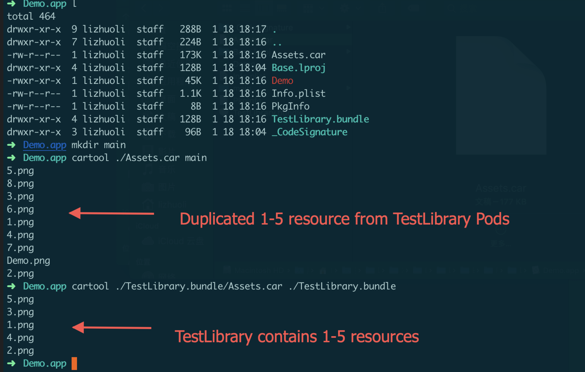

# CocoaPods Bug


# What's for

It seems that CocoaPods have a really huge bug about Asset Catalog, the root case came from 4 years ago, but not been fixed till today(2019/1/18). The latest 1.6.0-beta2 still have this issue. So I create a demo to trigger the issue and show the result.

> Seems there are already some people found the issue, like https://github.com/CocoaPods/CocoaPods/issues/6159. But sadly, no changes was merged to fix this till today.

# Issue

CocoaPods support you to use Asset Catalog `xcassets` inside Pods. You can use one of these two syntax to include a xcassets resource.

+ Using `resource_bundles`

```
s.resource_bundles = {
'TestLibrary' => ['TestLibrary/Assets/TestLibrary.xcassets']
}
```

+ Using `resources`

```
s.resources = ['TestLibrary2/Assets/TestLibrary2.xcassets']
```

However, when your Application project, including **at least 1** Pods using the `resources` with xcassets. Then all the Pods' xcassets resource (whatever it come from), will be duplicated twice, inside your App's main bundle. It stored inside your App's product app's root path via `Assets.car`.

See the screenshot here. The App's main bundle `Assets.car`, contains all the other Pods's image resources. However, the `TestLibrary` itself also contains its image resources.



But, since `TestLibrary` using `resource_bundles`, its resource should not appear outside its bundle. The Main bundle should not contains 1-5.png.

# Reproduce

Clone this repo, run `pod install`, then build and check the Product app.

You can use [cartool](https://github.com/steventroughtonsmith/cartool) to export images inside `Assets.car`

# Fix or workaround ?

The bug was cause by the shell script phase. `[CP] Copy Pods Resources`. To fix that, just modify one line inside that script. The script is generated each time you run `pod install`. The original source code is [here](https://github.com/CocoaPods/CocoaPods/blob/master/lib/cocoapods/generator/copy_resources_script.rb).

Original:

```bash
  # Find all other xcassets (this unfortunately includes those of path pods and other targets).
  OTHER_XCASSETS=$(find "$PWD" -iname "*.xcassets" -type d)
  while read line; do
    if [[ $line != "${PODS_ROOT}*" ]]; then
      XCASSET_FILES+=("$line")
    fi
  done <<<"$OTHER_XCASSETS"
```

Patch:

```diff
<     if [[ $line != "${PODS_ROOT}*" ]]; then
---
>     if [[ $line != ${PODS_ROOT}* ]]; then
```

It seems that the author want to do filter of that `Pods` folder, but use the wrong shell syntax. The condition check always passed. So that all your current working directory's `xcassets` will be compiled into main bundle.

To say, I'm also disagreed with this `Find all other xcassets` logic, which does not check the project logic group but based on directory. A better solution, is that we use xcodeproj to search all xcassets resources should be compiled for the current build target. Which base on the project but not file directory.

For workaround, add this patch in your `Podfile`'s post_install script. Because you can not always assume all Pods using xcassets with `resource_bundles`. If at least 1 use that `resource` syntax, you'll enter the trap :)


